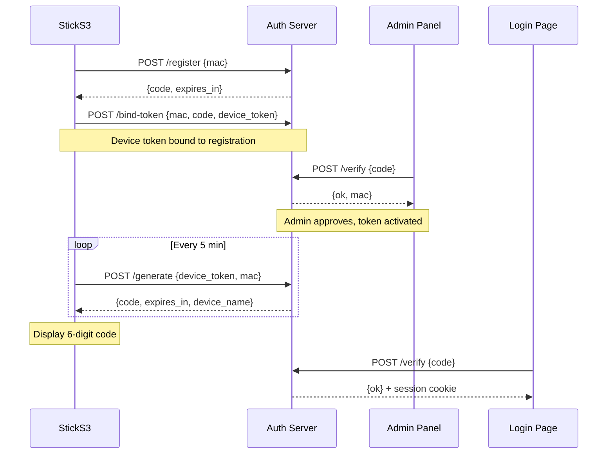

# AuthStick

ESP32-S3 physical authentication terminal. 6-digit codes displayed on screen,
independent token encryption, MAC-based spoofing impossible. No LLM, no voice — pure hardware auth.  
[简体中文](README_CN.md) · [Blog](https://whitefirer.org) · [GitHub](https://github.com/whitefirer/authstick)

## Why

Typing verification codes or relying on TTS is slow and insecure. This device:
- Shows codes on screen, never spoken aloud
- Physical buttons for instant approve/deny
- Device MAC provides hardware identity
- WiFi provisioning via phone — no desktop needed
- Admin approval required for device registration

## Hardware

- M5Stack StickS3 (ESP32-S3-PICO-1-N8R8)
- 135x240 ST7789 display (LVGL)
- 2 physical buttons: A (front, GPIO11), B (side, GPIO12)
- [Official docs](https://docs.m5stack.com/en/core/StickS3)

### Pinout

| Function | GPIO | Notes |
|----------|------|-------|
| LCD MOSI | 39 | ST7789 SPI |
| LCD SCK  | 40 | ST7789 SPI |
| LCD DC   | 45 | RS/DC |
| LCD CS   | 41 | Chip select |
| LCD RST  | 21 | Reset |
| LCD BL   | 38 | Backlight |
| Button A | 11 | Front: confirm / toggle backlight |
| Button B | 12 | Side: menu / back |

## Quick Start

```bash
# Server
cd server && pip install fastapi uvicorn
python3 server.py --port 8998

# Firmware (requires ESP-IDF v5.5)
cd firmware && bash build.sh

# Web Flash (no tools needed)
cd web-flash && python3 -m http.server 8999
# Open http://localhost:8999 in Chrome/Edge
```

## Boot Flow

```
Power on → check NVS for WiFi
  ├─ Saved WiFi → connect → check device status
  │   ├─ Registered + has token → idle → device proactively fetches 6-digit codes
  │   │   → code displayed with device name & expiry → user enters on /login
  │   └─ Not registered / no token → POST /api/device/register
  │       → display 6-digit code → POST /api/device/bind-token
  │       → admin verifies at /admin → token activated → idle
  └─ No saved WiFi → AP mode (AuthStick-XXXX)
      → phone connects → captive portal at 192.168.4.1
      → configure WiFi + auth server URL → done → reboot
```

## Captive Portal Tabs

| Tab | Description |
|-----|-------------|
| WiFi Config | Scan/connect to WiFi, saved networks management |
| Auth Server | Set auth server URL (default: sdkconfig CONFIG_AUTH_SERVER_URL) |
| Advanced | OTA URL, TX power, BSSID, sleep mode |

## WiFi + Auth Config Flow

1. Device boots without WiFi → AP `AuthStick-XXXX` appears
2. Phone connects to AP → captive portal at `192.168.4.1`
3. **Wi-Fi tab**: select and connect to WiFi
4. WiFi configured → done page → "Set up auth server" → Auth tab
5. **Auth tab**: set server URL (saved to NVS) → "Done, restart"
6. Device reboots → connects WiFi → registers with auth server

## Architecture

```
AuthStick ──WiFi──→ Auth Server (:8998)
  │                    │
  ├─ POST /api/stick/generate {token,mac} ← device fetches 6-digit code
  ├─ POST /api/device/register {mac}      ← first boot registration
  ├─ POST /api/device/bind-token          ← bind token to registration
  ├─ POST /api/stick/rotate-token         ← auto-rotate token every 24h
  └─ Display shows code + expiry + device name

Admin ──→ /admin                           ← verify devices, manage tokens
User  ──→ /login                           ← enter code from device screen
```

## Auth Sequence



<details>
<summary>Text version</summary>

```
  StickS3              Auth Server           Admin Panel         Login Page
    │                      │                     │                   │
    │──POST /register {mac}→│                     │                   │
    │←──{code, expires_in}──│                     │                   │
    │──POST /bind-token────→│                     │                   │
    │                      │←──POST /verify {code}│                   │
    │                      │──→{ok, mac}          │                   │
    │←──poll /status────────│                     │                   │
    │──POST /generate──────→│                     │                   │
    │   {device_token, mac} │                     │                   │
    │←──{code,expires_in}───│                     │                   │
    │                      │                     │←──POST /verify {code}
    │                      │                     │──→{ok} + session cookie
```

</details>

## Server Endpoints

| Method | Path | Description |
|--------|------|-------------|
| GET | `/login` | Web login page (code input only) |
| POST | `/api/code/verify` | Verify login code `{code}` |
| POST | `/api/stick/generate` | Device fetches 6-digit code `{token, mac}` |
| POST | `/api/device/register` | Start device registration `{mac}` |
| POST | `/api/device/bind-token` | Bind token to registration code `{mac, code, device_token}` |
| POST | `/api/stick/rotate-token` | Rotate device token `{token, mac}` |
| GET | `/api/device/status?mac=` | Poll registration status |
| GET | `/admin` | Admin panel — device list, verify, rename, ban, reset token, remove |
| POST | `/api/admin/verify-device` | Verify device registration `{code}` |
| POST | `/api/admin/reset-token` | Clear token to force re-registration `{mac}` |
| POST | `/api/admin/rename` | Rename device `{mac, name}` |
| POST | `/api/admin/ban` / `/api/admin/unban` | Ban/unban device `{mac}` |
| POST | `/api/admin/remove` | Remove device `{mac}` |

## Firmware Configuration

```bash
cd firmware
idf.py menuconfig
```

Key config:
- `CONFIG_AUTH_SERVER_URL` — default auth server (sdkconfig.defaults)
- `CONFIG_HTTPD_MAX_REQ_HDR_LEN=1024` — avoids captive portal 431 errors
- `CONFIG_DISPLAY_*` — display pins (matches StickS3)
- `CONFIG_BTN_*` — button pins + long-press threshold
- Custom partition table in `partitions.csv` (2MB factory)

Defaults in `sdkconfig.defaults` match StickS3 pinout.

## Project Structure

```
server/
  auth.py              CodeStore + DeviceStore + SessionStore
  server.py            FastAPI app, all endpoints + admin UI
firmware/
  main/
    main.cpp           App entry, boot flow, registration, main loop
    CMakeLists.txt     Font selection, component dependencies
    idf_component.yml  Managed components
    Kconfig            WiFi defaults
  components/
    auth_client/       HTTP client for server API
    auth_button/       Button input handling (short/long press)
    display/           ST7789 + LVGL display driver + UI
  partitions.csv       Custom partition table (2MB factory)
  sdkconfig.defaults   Default Kconfig values
web-flash/
  index.html           Web Serial flash page (esptool-js)
  authstick-merged.bin Merged firmware binary
```

## Key Design Decisions

- **HTTP client**: NEVER use `esp_http_client` — conflicts with custom lwip stack. Always use `g_network.CreateHttp()` (raw TCP via lwip from 78/esp-ml307). HTTP polling runs in separate FreeRTOS task to avoid lock contention with LVGL.
- **Display safety**: All LVGL operations run in main task only. Poll task communicates via flags (`g_code_pending`, `g_pending_banned`). Menu overlay always top layer — base page updates check `!display_has_overlay()`.
- **Security**: Device generates 128-bit `device_token` on first boot. Token bound via one-time registration code. Token never appears in server responses. Auto-rotates every 24h.
- **Font**: `font_puhui_14_1` (Chinese/English) + `font_digits_30_4` (verification codes, 30px) + `font_awesome_14_1` (icons).
- **Language**: `t("中文", "English")` for all UI text. NVS-persisted, survives reboot. `nvs_flash_init()` MUST run before `display_init()`.

## License

MIT
