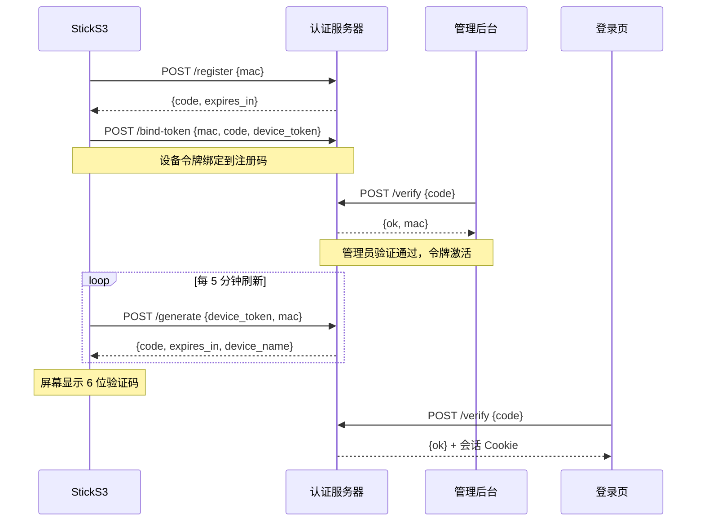

# AuthStick

ESP32-S3 物理认证终端。6 位验证码显示在设备屏幕上，网页输入即验证。独立令牌加密通信，无法通过 MAC 地址伪造。  
[English](README.md) · [Blog](https://whitefirer.org) · [GitHub](https://github.com/whitefirer/authstick)

## 为什么用 AuthStick

短信验证码走公共通道可被截获，TOTP App 与登录同设备形同虚设。AuthStick 是独立的硬件令牌——设备即身份，物理隔离。

## 硬件

- M5Stack StickS3 (ESP32-S3-PICO-1-N8R8)
- 135×240 ST7789 屏幕
- 2 个物理按键: A (正面主键), B (右侧键)
- [官方文档](https://docs.m5stack.com/en/core/StickS3)

### 引脚定义

| 功能 | GPIO | 备注 |
|------|------|------|
| LCD MOSI | 39 | ST7789 SPI |
| LCD SCK  | 40 | ST7789 SPI |
| LCD DC   | 45 | RS/DC |
| LCD CS   | 41 | 片选 |
| LCD RST  | 21 | 复位 |
| LCD BL   | 38 | 背光 |
| 按键 A | 11 | 正面主键 (熄屏/确认) |
| 按键 B | 12 | 右侧键 (菜单/返回) |

## 快速开始

```bash
# 服务端
cd server && pip install fastapi uvicorn
python3 server.py --port 8998

# 固件编译 (需要 ESP-IDF v5.5)
cd firmware && bash build.sh

# 在线烧录 (无需安装工具)
cd web-flash && python3 -m http.server 8999
# 浏览器打开 http://localhost:8999
```

## 启动流程

```
开机 → 检查 NVS 中的 WiFi 配置
  ├─ 有保存的 WiFi → 连接 → 检查设备状态
  │   ├─ 已注册 + 有令牌 → 空闲 → 设备主动获取 6 位验证码
  │   │   → 显示验证码 + 设备名 + 有效期 → 用户在 /login 输入
  │   └─ 未注册 / 无令牌 → POST /api/device/register
  │       → 显示 6 位注册码 → POST /api/device/bind-token
  │       → 管理员在 /admin 验证 → 令牌激活 → 进入空闲
  └─ 无保存 WiFi → AP 模式 (AuthStick-XXXX)
      → 手机连接热点 → 访问 192.168.4.1 配置
      → 设置 WiFi + 认证服务地址 → 完成 → 重启
```

## 认证时序



<details>
<summary>文本版</summary>

```
  StickS3              认证服务器           管理后台           登录页
    │                      │                   │                 │
    │──POST /register {mac}→│                   │                 │
    │←──{code, expires}─────│                   │                 │
    │──POST /bind-token────→│                   │                 │
    │                      │←──POST /verify {code}│               │
    │                      │──→{ok, mac}        │                 │
    │←──poll /status────────│                   │                 │
    │──POST /generate──────→│                   │                 │
    │   {device_token, mac} │                   │                 │
    │←──{code,expires_in}───│                   │                 │
    │                      │                   │←──POST /verify {code}
    │                      │                   │──→{ok} + 会话 Cookie
```

</details>

## 架构

```
AuthStick ──WiFi──→ 认证服务器 (:8998)
  │                      │
  ├─ POST /api/stick/generate   ← 获取验证码
  ├─ POST /api/device/register  ← 设备注册
  ├─ POST /api/device/bind-token ← 绑定令牌
  ├─ POST /api/stick/rotate-token ← 轮换令牌 (每24h)
  └─ 屏幕显示验证码 + 有效期 + 设备名

管理员 ──→ /admin               ← 验证设备、管理令牌
用户   ──→ /login               ← 输入设备屏幕上的验证码
```

## 安全模型

- **设备令牌**: 设备首次启动通过 `esp_random()` 生成 128 位随机令牌，存于 NVS
- **令牌绑定**: 令牌通过一次性注册码绑定到服务端，绝不出现于任何服务端响应
- **双因子验证**: 获取验证码需 token + MAC 同时匹配
- **自动轮换**: 每 24 小时自动轮换令牌，旧令牌换新令牌
- **管理员重置**: 后台"重置令牌"强制设备重新注册

## 服务端接口

| 方法 | 路径 | 说明 |
|------|------|------|
| GET | `/login` | 登录页 (仅验证码输入框) |
| POST | `/api/code/verify` | 验证登录码 |
| POST | `/api/stick/generate` | 设备获取验证码 `{token, mac}` |
| POST | `/api/device/register` | 开始设备注册 `{mac}` |
| POST | `/api/device/bind-token` | 绑定令牌到注册码 `{mac, code, device_token}` |
| POST | `/api/stick/rotate-token` | 轮换令牌 `{token, mac}` |
| GET | `/api/device/status?mac=` | 查询设备状态 |
| GET | `/admin` | 管理后台 |
| POST | `/api/admin/verify-device` | 验证注册码 |
| POST | `/api/admin/reset-token` | 重置令牌 |
| POST | `/api/admin/rename` | 重命名设备 |
| POST | `/api/admin/ban` / `/api/admin/unban` | 封禁/解封 |
| POST | `/api/admin/remove` | 移除设备 |

## 关键设计决策

- **HTTP 客户端**: 绝对不要用 `esp_http_client`——与自定义 lwip 栈冲突。统一用 `g_network.CreateHttp()`（78/esp-ml307 组件）。轮询在独立 FreeRTOS 任务中运行，避免和 LVGL 主线抢锁。
- **显示安全**: 所有 LVGL 操作仅在主任务。轮询任务通过标志位 (`g_code_pending`, `g_pending_banned`) 异步通信。菜单 Overlay 永远最上层。
- **语言**: 所有文本用 `t("中文", "English")`。NVS 持久化，重启不丢。`nvs_flash_init()` 必须在 `display_init()` 之前。
- **字体**: `font_puhui_14_1` (中英文) + `font_digits_30_4` (验证码, 30px) + `font_awesome_14_1` (图标)

## 许可证

MIT
